# 🎨 DeepFabric - Kapsamlı Kullanım Rehberi

## 📑 İçindekiler

1. [Giriş ve Genel Bakış](#1-giriş-ve-genel-bakış)
2. [Kurulum](#2-kurulum)
3. [Temel Kavramlar](#3-temel-kavramlar)
4. [CLI Kullanımı](#4-cli-kullanımı)
5. [YAML Konfigürasyon](#5-yaml-konfigürasyon)
6. [SDK Kullanımı](#6-sdk-kullanımı)
7. [Provider'lar ve Modeller](#7-providerlar-ve-modeller)
8. [Pratik Örnekler](#8-pratik-örnekler)
9. [İleri Seviye Kullanım](#9-ileri-seviye-kullanım)
10. [Best Practices](#10-best-practices)
11. [Troubleshooting](#11-troubleshooting)

---

## 1. Giriş ve Genel Bakış

### 🎯 DeepFabric Nedir?

**DeepFabric** (eski adı: promptwright), büyük dil modellerini (LLM) kullanarak **yüksek kaliteli sentetik veri setleri** oluşturmak için geliştirilmiş bir **CLI aracı** ve **Python SDK**'dır.

### 📊 Kullanım Alanları

| Alan | Açıklama | Örnek |
|------|----------|-------|
| **Model Distillation** | Büyük öğretmen modellerden küçük öğrenci modellere bilgi aktarımı | GPT-4 → Llama-7B |
| **Evaluation Benchmarks** | Model ve agent'ların performansını ölçmek için test setleri | MMLU, HellaSwag gibi |
| **Fine-tuning Data** | Özel domain'ler için eğitim verisi | Medikal, legal, finans |
| **Synthetic Training** | Gerçek veri olmadan model eğitimi | Gizlilik gerektiren projeler |

### 🌟 Ana Özellikler

#### ✅ Graf ve Ağaç Tabanlı Mimari
- **Topic Tree**: Hiyerarşik konu yapıları
- **Topic Graph**: Karmaşık ilişkilerle birbirine bağlı konular
- Minimal duplikasyon, maksimum çeşitlilik

#### ✅ Çoklu LLM Desteği
- OpenAI (GPT-4, GPT-3.5)
- Anthropic (Claude)
- Google (Gemini)
- Ollama (Yerel modeller)
- OpenRouter (Çoklu model erişimi)

#### ✅ Esnek Veri Formatları
- OpenAI Chat Format (varsayılan)
- Özelleştirilebilir format dönüştürücüleri (yakında)
- Multi-turn konuşmalar
- Chain of Thought
- Tool calling

#### ✅ Hibrit Model Kullanımı
```yaml
# Topic generation için pahalı model
topic_tree:
  provider: "openai"
  model: "gpt-4"

# Data generation için ucuz model  
data_engine:
  provider: "ollama"
  model: "llama3:70b"
```

#### ✅ Hugging Face Entegrasyonu
- Otomatik dataset upload
- Dataset card oluşturma
- Tag yönetimi

---

## 2. Kurulum

### 📦 Temel Kurulum

```bash
# PyPI'dan kurulum
pip install deepfabric

# GitHub'dan en son versiyon
pip install git+https://github.com/lukehinds/deepfabric.git

# Geliştirme modu
git clone https://github.com/lukehinds/deepfabric.git
cd deepfabric
pip install -e .
```

### 🔑 API Anahtarları

DeepFabric, environment variable'lar üzerinden API anahtarlarını alır:

```bash
# OpenAI
export OPENAI_API_KEY="sk-..."

# Anthropic (Claude)
export ANTHROPIC_API_KEY="sk-ant-..."

# Google (Gemini)
export GEMINI_API_KEY="..."

# OpenRouter
export OPENROUTER_API_KEY="sk-or-..."

# Hugging Face (opsiyonel)
export HF_TOKEN="hf_..."
```

### ✅ Kurulum Doğrulama

```bash
# DeepFabric versiyonunu kontrol et
deepfabric --version

# Yardım menüsünü göster
deepfabric --help

# Basit test
deepfabric generate --help
```

---

## 3. Temel Kavramlar

### 🌳 Topic Tree (Konu Ağacı)

Topic Tree, veri üretiminin **birinci aşamasıdır** ve organize bir konu hiyerarşisi oluşturur.

#### Neden Topic Tree?

**Olmadan:**
```
❌ "Python nedir?"
❌ "Java syntax"
❌ "Matematik problemi"
❌ "Rastgele sorular..."
```

**İle:**
```
✅ Python → Veri Tipleri → Liste İşlemleri
✅ Python → Fonksiyonlar → Lambda Expressions
✅ Python → OOP → Inheritance
✅ Organize, ilişkili, çeşitli konular
```

#### Topic Tree Parametreleri

| Parametre | Açıklama | Örnek | Etki |
|-----------|----------|-------|------|
| `depth` | Ağaç derinliği | `3` | 3 seviye hiyerarşi |
| `degree` | Her düğümden kaç dal | `4` | Her konudan 4 alt konu |
| `topic_prompt` | Ana konu | `"ML Fundamentals"` | Temel konu başlığı |
| `temperature` | Yaratıcılık | `0.7` | Çeşitli konular |

#### Matematiksel İlişki

```
Toplam konu sayısı ≈ Σ(degree^i) for i in range(1, depth+1)

Örnekler:
depth=2, degree=3 → 3¹ + 3² = 3 + 9 = 12 konu
depth=3, degree=4 → 4¹ + 4² + 4³ = 4 + 16 + 64 = 84 konu
depth=4, degree=5 → 5¹ + 5² + 5³ + 5⁴ = 780 konu
```

### ⚙️ Data Engine (Veri Motoru)

Data Engine, topic tree'den gelen konuları kullanarak **gerçek eğitim verisi** üretir.

#### Data Engine İşleyişi

```
Topic Tree → "Liste Comprehension in Python"
            ↓
Data Engine işler
            ↓
Output: {
  "messages": [
    {
      "role": "user",
      "content": "List comprehension nedir ve nasıl kullanılır?"
    },
    {
      "role": "assistant", 
      "content": "List comprehension, Python'da liste oluşturmanın..."
    }
  ]
}
```

#### Data Engine Parametreleri

| Parametre | Açıklama | Değer Aralığı | Önerilen |
|-----------|----------|---------------|----------|
| `num_steps` | Kaç örnek | 1 - ∞ | 100-1000 |
| `batch_size` | Paralel işlem | 1 - 10 | 3-5 |
| `temperature` | Tutarlılık | 0.0 - 1.0 | 0.3-0.5 |
| `conversation_type` | Veri tipi | cot, tool, multi-turn, qa, code | - |

### 🆚 Topic Tree vs Data Engine

```mermaid
graph LR
    A[Kullanıcı] --> B[Topic Tree]
    B -->|Konu Hiyerarşisi| C[Data Engine]
    C -->|Q&A Çiftleri| D[Dataset JSONL]
    
    B -.->|Yüksek temp 0.7| B
    B -.->|Güçlü model GPT-4| B
    
    C -.->|Düşük temp 0.5| C
    C -.->|Ucuz model Llama| C
```



**Fark:**
- **Topic Tree**: "Ne" konuşulacağını belirler (konu üretimi)
- **Data Engine**: "Nasıl" konuşulacağını belirler (veri üretimi)

---

## 4. CLI Kullanımı

### 🚀 Hızlı Başlangıç

#### En Basit Kullanım

```bash
deepfabric generate \
  --mode tree \
  --provider openai \
  --model gpt-4o \
  --depth 2 \
  --degree 3 \
  --num-steps 10 \
  --topic-prompt "Python Programming Basics" \
  --dataset-save-as my_dataset.jsonl
```

**Ne yapar?**
1. 2 seviyeli, 3'er dallı topic tree oluşturur (9 konu)
2. Her konu için 10 Q&A çifti üretir
3. `my_dataset.jsonl` dosyasına kaydeder

### 📝 Tüm CLI Parametreleri

```bash
deepfabric generate \
  # Temel parametreler
  --mode tree \                           # veya 'graph'
  --provider openai \                     # LLM sağlayıcı
  --model gpt-4-turbo \                   # Model adı
  
  # Topic Tree parametreleri
  --depth 3 \                             # Ağaç derinliği
  --degree 4 \                            # Dallanma sayısı
  --topic-prompt "Machine Learning" \     # Ana konu
  --save-tree topics.jsonl \              # Topic tree kaydet
  --temperature 0.7 \                     # Yaratıcılık
  
  # Data Engine parametreleri
  --num-steps 100 \                       # Örnek sayısı
  --batch-size 5 \                        # Batch boyutu
  --generation-system-prompt "You are..." \ # Özel prompt
  
  # Output parametreleri
  --dataset-save-as dataset.jsonl \       # Dataset kaydet
  --sys-msg true \                        # System mesajı dahil
  
  # Hugging Face parametreleri
  --hf-repo username/dataset-name \       # HF repo
  --hf-token $HF_TOKEN \                  # HF token
  --hf-tags tag1 --hf-tags tag2           # Etiketler
```

### 🎯 Yaygın Kullanım Senaryoları

#### Senaryo 1: Hızlı Test

```bash
deepfabric generate \
  --provider ollama \
  --model llama3:8b \
  --depth 1 \
  --degree 2 \
  --num-steps 5 \
  --topic-prompt "Python Basics" \
  --dataset-save-as test.jsonl
```

**Süre:** ~1 dakika  
**Çıktı:** 5 örnek, 2 konu

#### Senaryo 2: Orta Ölçekli Dataset

```bash
deepfabric generate \
  --provider openai \
  --model gpt-4o \
  --depth 2 \
  --degree 3 \
  --num-steps 100 \
  --batch-size 5 \
  --topic-prompt "Data Science with Python" \
  --dataset-save-as data_science_100.jsonl
```

**Süre:** ~30 dakika  
**Çıktı:** 100 örnek, 12 konu

#### Senaryo 3: Büyük Dataset + HF Upload

```bash
deepfabric generate \
  --provider openrouter \
  --model meta-llama/llama-3.1-70b-instruct \
  --depth 3 \
  --degree 4 \
  --num-steps 1000 \
  --batch-size 5 \
  --topic-prompt "Advanced Machine Learning Algorithms" \
  --dataset-save-as ml_1000.jsonl \
  --hf-repo myusername/ml-qa-dataset \
  --hf-token $HF_TOKEN
```

**Süre:** ~5-8 saat  
**Çıktı:** 1000 örnek, 84 konu, HF'e yüklendi

#### Senaryo 4: Hibrit Model Kullanımı

```bash
# Bu senaryo için YAML kullanmak daha iyi (aşağıda)
```

---

## 5. YAML Konfigürasyon

### 📄 Neden YAML?

YAML konfigürasyonu şunları sağlar:
- ✅ Karmaşık ayarları organize etme
- ✅ Hibrit model kullanımı
- ✅ Tekrar kullanılabilirlik
- ✅ Versiyon kontrolü (Git)
- ✅ Dokümantasyon

### 🎨 Tam Özellikli YAML Örneği

```yaml
# ============================================
# DeepFabric Konfigürasyon Dosyası
# ============================================

# Ana sistem prompt'u (fallback olarak kullanılır)
dataset_system_prompt: |
  Sen bir uzman AI asistanısın. Kullanıcılara 
  net, eğitici ve doğru bilgiler sağlarsın.

# ============================================
# TOPIC TREE - Konu Hiyerarşisi Oluşturma
# ============================================
topic_tree:
  # Ana konu tanımı
  topic_prompt: |
    Python Programlama: Temel kavramlardan ileri seviye 
    tekniklere kadar Python ile yazılım geliştirme
  
  # LLM Ayarları
  provider: "openai"              # openai, anthropic, gemini, ollama
  model: "gpt-4-turbo"            # Model adı
  temperature: 0.7                # 0.0 = deterministik, 1.0 = yaratıcı
  
  # Ağaç Yapısı
  degree: 3                       # Her düğümden 3 alt konu
  depth: 3                        # 3 seviye derinlik
  
  # Özel topic generation prompt (opsiyonel)
  topic_system_prompt: |
    Sen bir müfredat tasarım uzmanısın. 
    Konuları mantıklı bir sırayla organize et:
    1. Kolay kavramlar önce
    2. Önkoşul bilgiler sıralı
    3. Pratik uygulamalar dahil
  
  # Output
  save_as: "python_topics_tree.jsonl"

# ============================================
# DATA ENGINE - Veri Üretimi
# ============================================
data_engine:
  # Genel talimatlar
  instructions: |
    Her konu için:
    - Açık ve anlaşılır sorular sor
    - Detaylı ve öğretici cevaplar ver
    - Kod örnekleri ekle
    - Best practices belirt
  
  # LLM Ayarları (Topic'ten farklı olabilir!)
  provider: "ollama"              # Ucuz/hızlı model
  model: "llama3:70b"
  temperature: 0.4                # Daha tutarlı cevaplar
  max_retries: 3                  # Hata durumunda tekrar
  
  # Özel generation prompt
  generation_system_prompt: |
    Sen bir Python eğitmenisin. Her soruya:
    1. Kavramı açıkla
    2. Çalışan kod örneği ver
    3. Edge case'leri belirt
    4. Common mistake'leri açıkla
  
  # Conversation type (opsiyonel)
  conversation_type: "qa"         # qa, cot, tool_calling, multi_turn, code

# ============================================
# DATASET - Final Veri Seti Oluşturma
# ============================================
dataset:
  creation:
    num_steps: 100                # 100 eğitim örneği
    batch_size: 5                 # 5'er 5'er işle
    sys_msg: true                 # System mesajı dahil et
  
  # Output
  save_as: "python_programming_dataset.jsonl"

# ============================================
# HUGGING FACE (Opsiyonel)
# ============================================
huggingface:
  # Repository bilgileri
  repository: "myusername/python-qa-dataset"
  
  # Token (veya environment variable: HF_TOKEN)
  token: "hf_..."
  
  # Ek etiketler (deepfabric ve synthetic otomatik eklenir)
  tags:
    - "python"
    - "programming"
    - "educational"
    - "synthetic-data"
```

### 🚀 YAML ile Kullanım

```bash
# YAML dosyasını kullan
deepfabric generate config.yaml

# YAML + CLI override
deepfabric generate config.yaml \
  --num-steps 200 \
  --temperature 0.6
```

### 📋 Minimal YAML Örneği

```yaml
# Minimum gereksinimler
dataset_system_prompt: "Sen bir yardımcı asistansın."

topic_tree:
  topic_prompt: "Python Basics"
  provider: "ollama"
  model: "llama3:8b"
  degree: 2
  depth: 2

data_engine:
  provider: "ollama"
  model: "llama3:8b"

dataset:
  creation:
    num_steps: 10
  save_as: "dataset.jsonl"
```

### 🎯 Farklı Amaçlar için YAML Şablonları

#### Şablon 1: Chain of Thought (Matematik/Problem Solving)

```yaml
dataset_system_prompt: "Sen bir matematik öğretmenisin."

topic_tree:
  topic_prompt: "Matematik Problemleri: Algebra, Geometri, Calculus"
  provider: "openai"
  model: "gpt-4-turbo"
  temperature: 0.7
  degree: 3
  depth: 2

data_engine:
  generation_system_prompt: |
    Her problemi adım adım çöz:
    1. Problemi anla
    2. Yaklaşımı belirle
    3. Adım adım çöz
    4. Sonucu doğrula
  
  conversation_type: "chain_of_thought"
  provider: "openai"
  model: "gpt-4-turbo"
  temperature: 0.5

dataset:
  creation:
    num_steps: 50
    batch_size: 3
  save_as: "math_cot.jsonl"
```

#### Şablon 2: Code Generation

```yaml
dataset_system_prompt: "Sen bir yazılım mühendisisin."

topic_tree:
  topic_prompt: "Python Algoritmaları ve Veri Yapıları"
  provider: "anthropic"
  model: "claude-3-sonnet-20240229"
  temperature: 0.6
  degree: 4
  depth: 2

data_engine:
  generation_system_prompt: |
    Her problem için:
    - Çalışan Python kodu yaz
    - Yorum satırları ekle
    - Zaman karmaşıklığını belirt
    - Test case'leri ver
  
  conversation_type: "code"
  provider: "anthropic"
  model: "claude-3-sonnet-20240229"
  temperature: 0.3  # Düşük = çalışan kod

dataset:
  creation:
    num_steps: 100
    batch_size: 5
  save_as: "python_code.jsonl"
```

#### Şablon 3: Multi-Turn Conversations

```yaml
dataset_system_prompt: "Sen bir dost canlısı chatbot'sun."

topic_tree:
  topic_prompt: "Günlük Konuşma Konuları: Hobiler, Seyahat, Teknoloji"
  provider: "openai"
  model: "gpt-4o"
  temperature: 0.8  # Yüksek = çeşitli konuşmalar
  degree: 3
  depth: 3

data_engine:
  generation_system_prompt: |
    Doğal bir konuşma yarat:
    - 3-5 tur konuşma
    - Context'i koru
    - Arkadaşça ton
    - İlgi göster
  
  conversation_type: "multi_turn"
  provider: "openai"
  model: "gpt-4o"
  temperature: 0.7  # Yüksek = doğal konuşma

dataset:
  creation:
    num_steps: 200
    batch_size: 5
  save_as: "chatbot_conversations.jsonl"
```

---

## 6. SDK Kullanımı

### 🐍 Python SDK ile Programatik Kullanım

DeepFabric'i Python kodundan kullanmak için:

```python
from deepfabric import TopicTree, DataEngine, Dataset

# 1. Topic Tree oluştur
topic_tree = TopicTree(
    topic_prompt="Machine Learning Fundamentals",
    provider="openai",
    model="gpt-4-turbo",
    temperature=0.7,
    degree=3,
    depth=2
)

# Topic'leri üret
topics = topic_tree.generate()
print(f"Oluşturulan konu sayısı: {len(topics)}")

# Topic'leri kaydet
topic_tree.save("topics.jsonl")

# 2. Data Engine ile veri üret
data_engine = DataEngine(
    topics=topics,
    provider="ollama",
    model="llama3:70b",
    temperature=0.5,
    conversation_type="qa"
)

# Veri üret
dataset = data_engine.generate(
    num_steps=100,
    batch_size=5
)

# 3. Dataset'i kaydet
dataset.save("ml_dataset.jsonl")

# HuggingFace'e yükle (opsiyonel)
dataset.push_to_hub(
    repo_id="username/ml-qa-dataset",
    token="hf_..."
)
```

### 📊 Daha Gelişmiş SDK Kullanımı

```python
from deepfabric import DeepFabric

# Tam pipeline
fabric = DeepFabric(
    # Topic Tree config
    topic_config={
        "topic_prompt": "Python Web Development",
        "provider": "openai",
        "model": "gpt-4-turbo",
        "temperature": 0.7,
        "degree": 4,
        "depth": 3
    },
    
    # Data Engine config
    data_config={
        "provider": "ollama",
        "model": "llama3:70b",
        "temperature": 0.4,
        "conversation_type": "code",
        "generation_system_prompt": "Sen bir web development uzmanısın."
    },
    
    # Dataset config
    dataset_config={
        "num_steps": 200,
        "batch_size": 5,
        "sys_msg": True
    }
)

# Tüm pipeline'ı çalıştır
fabric.generate()

# Sonuçları kaydet
fabric.save("web_dev_dataset.jsonl")

# İstatistikleri görüntüle
stats = fabric.get_statistics()
print(f"Toplam konu: {stats['total_topics']}")
print(f"Toplam örnek: {stats['total_examples']}")
print(f"Ortalama cevap uzunluğu: {stats['avg_response_length']}")
```

### 🔧 Custom Handlers

```python
from deepfabric import TopicTree, DataEngine

# Custom topic handler
def my_topic_handler(topic):
    """Her topic için özel işlem"""
    print(f"İşleniyor: {topic['name']}")
    # Filtreleme
    if "advanced" in topic['name'].lower():
        topic['difficulty'] = "hard"
    return topic

# Custom data handler
def my_data_handler(data_point):
    """Her veri noktası için özel işlem"""
    # Format kontrolü
    if len(data_point['assistant']) < 50:
        return None  # Çok kısa cevapları atla
    return data_point

# Handler'ları kullan
topic_tree = TopicTree(
    topic_prompt="Python Advanced",
    handler=my_topic_handler
)

data_engine = DataEngine(
    topics=topic_tree.generate(),
    handler=my_data_handler
)

dataset = data_engine.generate(num_steps=100)
```

### 📝 Batch İşleme

```python
from deepfabric import DataEngine
import time

# Büyük dataset'i batch'ler halinde işle
def process_large_dataset():
    topics = load_topics("topics.jsonl")
    
    total_examples = 10000
    batch_size = 100
    
    data_engine = DataEngine(topics=topics)
    
    for i in range(0, total_examples, batch_size):
        print(f"İşleniyor: {i}-{i+batch_size}")
        
        batch = data_engine.generate(
            num_steps=batch_size,
            batch_size=10
        )
        
        # Batch'i kaydet
        batch.save(f"batch_{i}.jsonl")
        
        # Rate limit için bekle
        time.sleep(5)
    
    # Tüm batch'leri birleştir
    merge_batches("batch_*.jsonl", "final_dataset.jsonl")

process_large_dataset()
```

---

## 7. Provider'lar ve Modeller

### 🤖 Desteklenen Provider'lar

#### 1. OpenAI

```bash
# Environment variable
export OPENAI_API_KEY="sk-..."

# CLI
deepfabric generate \
  --provider openai \
  --model gpt-4-turbo \
  ...
```

```yaml
# YAML
topic_tree:
  provider: "openai"
  model: "gpt-4-turbo"  # veya gpt-4o, gpt-3.5-turbo
```

**Önerilen Modeller:**
- `gpt-4-turbo`: En güçlü, pahalı
- `gpt-4o`: Dengeli performans/maliyet
- `gpt-3.5-turbo`: Hızlı, ucuz, basit tasklar için

#### 2. Anthropic (Claude)

```bash
export ANTHROPIC_API_KEY="sk-ant-..."

deepfabric generate \
  --provider anthropic \
  --model claude-3-opus-20240229 \
  ...
```

```yaml
topic_tree:
  provider: "anthropic"
  model: "claude-3-opus-20240229"
  # veya: claude-3-sonnet-20240229, claude-3-haiku-20240307
```

**Önerilen Modeller:**
- `claude-3-opus`: En güçlü, karmaşık tasklar
- `claude-3-sonnet`: Dengeli, kod için mükemmel
- `claude-3-haiku`: En hızlı, basit tasklar

#### 3. Google (Gemini)

```bash
export GEMINI_API_KEY="..."

deepfabric generate \
  --provider gemini \
  --model gemini-pro \
  ...
```

```yaml
topic_tree:
  provider: "gemini"
  model: "gemini-pro"
```

#### 4. Ollama (Yerel)

```bash
# API key gerekmez, yerel çalışır

# Önce Ollama kurulumu
curl -fsSL https://ollama.com/install.sh | sh

# Model indir
ollama pull llama3:70b

# DeepFabric ile kullan
deepfabric generate \
  --provider ollama \
  --model llama3:70b \
  ...
```

```yaml
topic_tree:
  provider: "ollama"
  model: "llama3:70b"
  # veya: llama3:8b, mistral:7b, qwen3:32b
```

**Avantajlar:**
- 🆓 Tamamen ücretsiz
- 🔒 Veri gizliliği (yerel)
- ⚡ Rate limit yok

**Dezavantajlar:**
- 💻 Güçlü GPU gerekir
- 🐌 Cloud API'lerden yavaş

#### 5. OpenRouter

```bash
export OPENROUTER_API_KEY="sk-or-..."

deepfabric generate \
  --provider openrouter \
  --model meta-llama/llama-3.1-70b-instruct \
  ...
```

```yaml
topic_tree:
  provider: "openrouter"
  model: "meta-llama/llama-3.1-70b-instruct"
```

**Avantajlar:**
- 🌐 Tek API'den çoklu model
- 💰 Uygun fiyatlandırma
- 🚀 Çok sayıda model seçeneği

**Popüler OpenRouter Modelleri:**
```yaml
# Llama modelleri
model: "meta-llama/llama-3.1-70b-instruct"
model: "meta-llama/llama-3.1-8b-instruct"

# Mistral modelleri
model: "mistralai/mixtral-8x7b-instruct"
model: "mistralai/mistral-7b-instruct"

# Anthropic (OpenRouter üzerinden)
model: "anthropic/claude-3-sonnet"

# OpenAI (OpenRouter üzerinden)
model: "openai/gpt-4-turbo"
```

### 🎯 Model Seçim Rehberi

#### Maliyet Odaklı

```yaml
# EN UCUZ: Ücretsiz
topic_tree:
  provider: "ollama"
  model: "llama3:8b"
data_engine:
  provider: "ollama"
  model: "llama3:8b"

# UCUZ: OpenRouter
topic_tree:
  provider: "openrouter"
  model: "meta-llama/llama-3.1-70b-instruct"
data_engine:
  provider: "openrouter"
  model: "meta-llama/llama-3.1-8b-instruct"

# PAHALI: Premium modeller
topic_tree:
  provider: "openai"
  model: "gpt-4-turbo"
data_engine:
  provider: "anthropic"
  model: "claude-3-opus-20240229"
```

#### Kalite Odaklı

```yaml
# YÜK SEK KALİTE
topic_tree:
  provider: "openai"
  model: "gpt-4-turbo"          # En iyi topic generation
data_engine:
  provider: "anthropic"
  model: "claude-3-opus-20240229"  # En iyi data generation

# DENGELI KALİTE
topic_tree:
  provider: "openai"
  model: "gpt-4o"
data_engine:
  provider: "anthropic"
  model: "claude-3-sonnet-20240229"
```

#### Hız Odaklı

```yaml
# EN HIZLI (yerel)
topic_tree:
  provider: "ollama"
  model: "llama3:8b"
data_engine:
  provider: "ollama"
  model: "llama3:8b"

# HIZLI (cloud)
topic_tree:
  provider: "openai"
  model: "gpt-3.5-turbo"
data_engine:
  provider: "anthropic"
  model: "claude-3-haiku-20240307"
```

---

## 8. Pratik Örnekler

### 🎓 Örnek 1: Eğitim Materyali Üretimi

**Hedef:** Lise öğrencileri için matematik Q&A

```yaml
# math_education.yaml
dataset_system_prompt: |
  Sen bir lise matematik öğretmenisin. 
  Öğrencilere sabırlı ve açıklayıcı şekilde matematik öğretiyorsun.

topic_tree:
  topic_prompt: |
    Lise Matematik Müfredatı:
    - Algebra (denklemler, eşitsizlikler)
    - Geometri (şekiller, alan, hacim)
    - Trigonometri (sin, cos, tan)
    - Fonksiyonlar (grafik, türev)
  
  provider: "openai"
  model: "gpt-4o"
  temperature: 0.7
  degree: 4
  depth: 2

data_engine:
  generation_system_prompt: |
    Her soru için:
    1. Adım adım çözüm göster
    2. Görsel açıklamalar kullan (ASCII art)
    3. Yaygın hataları belirt
    4. Pratik örnekler ver
  
  conversation_type: "chain_of_thought"
  provider: "openai"
  model: "gpt-4o"
  temperature: 0.5

dataset:
  creation:
    num_steps: 200
    batch_size: 5
  save_as: "high_school_math.jsonl"

huggingface:
  repository: "edutech/high-school-math-qa"
  tags:
    - "education"
    - "mathematics"
    - "high-school"
```

```bash
# Çalıştır
deepfabric generate math_education.yaml
```

**Beklenen Output:**
```jsonl
{"messages": [
  {"role": "system", "content": "Sen bir lise matematik öğretmenisin..."},
  {"role": "user", "content": "2x + 5 = 15 denklemini nasıl çözerim?"},
  {"role": "assistant", "content": "Bu denklemi adım adım çözelim:\n\nAdım 1: Her iki taraftan 5 çıkar\n2x + 5 - 5 = 15 - 5\n2x = 10\n\nAdım 2: Her iki tarafı 2'ye böl\n2x / 2 = 10 / 2\nx = 5\n\nDoğrulama: 2(5) + 5 = 10 + 5 = 15 ✓"}
]}
```

### 💻 Örnek 2: Kod Üretimi için Dataset

**Hedef:** Python algoritma problemleri

```yaml
# python_coding.yaml
dataset_system_prompt: "Sen bir yazılım mühendisi ve algoritma uzmanısın."

topic_tree:
  topic_prompt: |
    Python Algoritmaları:
    - Sorting (QuickSort, MergeSort, HeapSort)
    - Searching (Binary Search, DFS, BFS)
    - Dynamic Programming (Fibonacci, Knapsack)
    - Data Structures (LinkedList, Tree, Graph)
  
  provider: "anthropic"
  model: "claude-3-sonnet-20240229"
  temperature: 0.6
  degree: 4
  depth: 2

data_engine:
  generation_system_prompt: |
    Her algoritma için:
    - Temiz, çalışan Python kodu
    - Docstring ile açıklama
    - Zaman karmaşıklığı (Big O)
    - Test case'leri
    - Edge case'leri ele al
  
  conversation_type: "code"
  provider: "anthropic"
  model: "claude-3-sonnet-20240229"
  temperature: 0.3  # Düşük = çalışan kod

dataset:
  creation:
    num_steps: 150
    batch_size: 5
  save_as: "python_algorithms.jsonl"
```

**Beklenen Output:**
```jsonl
{"messages": [
  {"role": "user", "content": "Binary search algoritmasını Python'da implement et"},
  {"role": "assistant", "content": "```python\ndef binary_search(arr: list, target: int) -> int:\n    \"\"\"\n    Binary search algoritması.\n    \n    Args:\n        arr: Sıralı liste\n        target: Aranan değer\n    \n    Returns:\n        Index (bulunursa), -1 (bulunamazsa)\n    \n    Time Complexity: O(log n)\n    Space Complexity: O(1)\n    \"\"\"\n    left, right = 0, len(arr) - 1\n    \n    while left <= right:\n        mid = (left + right) // 2\n        \n        if arr[mid] == target:\n            return mid\n        elif arr[mid] < target:\n            left = mid + 1\n        else:\n            right = mid - 1\n    \n    return -1\n\n# Test cases\nassert binary_search([1, 3, 5, 7, 9], 5) == 2\nassert binary_search([1, 3, 5, 7, 9], 10) == -1\nassert binary_search([], 5) == -1\n```"}
]}
```

### 🤖 Örnek 3: Chatbot Konuşmaları

**Hedef:** Doğal dil konuşmaları

```yaml
# chatbot_conversations.yaml
dataset_system_prompt: "Sen arkadaşça ve yardımsever bir chatbot'sun."

topic_tree:
  topic_prompt: |
    Günlük Konuşma Konuları:
    - Hobiler ve ilgi alanları
    - Seyahat deneyimleri
    - Teknoloji ve gadget'lar
    - Yemek ve tarifler
    - Spor ve fitness
  
  provider: "openai"
  model: "gpt-4o"
  temperature: 0.8  # Yüksek = çeşitli konuşmalar
  degree: 3
  depth: 3

data_engine:
  generation_system_prompt: |
    3-5 turlu doğal bir konuşma yarat:
    - Samimi ve arkadaşça ton
    - Context'i koru
    - Sorular sor, ilgi göster
    - Empati kur
    - Bilgi paylaş
  
  conversation_type: "multi_turn"
  provider: "openai"
  model: "gpt-4o"
  temperature: 0.7

dataset:
  creation:
    num_steps: 300
    batch_size: 5
  save_as: "chatbot_multi_turn.jsonl"
```

**Beklenen Output:**
```jsonl
{"messages": [
  {"role": "user", "content": "Fotoğrafçılık hobiyle mi ilgileniyorsun?"},
  {"role": "assistant", "content": "Evet, fotoğrafçılığa ilgi duyuyorum! Özellikle doğa ve manzara fotoğrafçılığı hoşuma gidiyor. Sen hiç fotoğrafçılıkla uğraştın mı?"},
  {"role": "user", "content": "Biraz, ama genelde telefon kamerasıyla çekiyorum"},
  {"role": "assistant", "content": "Telefon kameraları artık çok gelişti! Aslında önemli olan ekipman değil, kompozisyon ve ışık. Hangi tür fotoğraflar çekmeyi seviyorsun?"},
  {"role": "user", "content": "Genelde sokak fotoğrafları ve insanlar ilgimi çekiyor"},
  {"role": "assistant", "content": "Sokak fotoğrafçılığı harika bir alan! İnsanların doğal anlarını yakalamak gerçekten özel. Birkaç ipucu: golden hour'da (gün batımı) çek, kalabalık yerlere git, ve çekmeden önce izin almayı unutma. Hangi şehirde çekiyorsun?"}
]}
```

### 🏥 Örnek 4: Domain-Specific (Medikal)

**Hedef:** Tıbbi Q&A (dikkat: bu sadece örnek, gerçek medikal veriler için uzman danışılmalı)

```yaml
# medical_qa.yaml
dataset_system_prompt: |
  Sen bir tıbbi bilgi asistanısın. UYARI: Teşhis koymuyorsun, 
  sadece genel bilgi veriyorsun.

topic_tree:
  topic_prompt: |
    Genel Sağlık Bilgileri:
    - Yaygın hastalıklar ve belirtileri
    - Sağlıklı yaşam önerileri
    - İlk yardım bilgileri
    - Önleyici sağlık
  
  provider: "anthropic"
  model: "claude-3-opus-20240229"
  temperature: 0.6
  degree: 4
  depth: 2

data_engine:
  generation_system_prompt: |
    Her soru için:
    - Tıbbi açıdan doğru bilgi ver
    - Teşhis koyma, sadece bilgilendir
    - "Doktora danışın" uyarısı ekle
    - Kaynakları belirt (genel tıbbi literatür)
  
  provider: "anthropic"
  model: "claude-3-opus-20240229"
  temperature: 0.4  # Düşük = doğru bilgi

dataset:
  creation:
    num_steps: 100
    batch_size: 3
  save_as: "medical_general_qa.jsonl"
```

### 🛠️ Örnek 5: Tool Calling için Dataset

**Hedef:** API fonksiyon çağırma öğretimi

```yaml
# tool_calling.yaml
dataset_system_prompt: "Sen bir API asistanısın."

topic_tree:
  topic_prompt: |
    API Kullanım Senaryoları:
    - Hava durumu sorgulama
    - Çeviri işlemleri
    - Takvim yönetimi
    - Dosya işlemleri
  
  provider: "openai"
  model: "gpt-4o"
  temperature: 0.7
  degree: 3
  depth: 2

data_engine:
  generation_system_prompt: |
    Her senaryo için:
    - Kullanıcı isteğini anla
    - Doğru fonksiyonu seç
    - Parametreleri çıkar
    - Fonksiyonu çağır
    - Sonucu yorumla
  
  conversation_type: "tool_calling"
  provider: "openai"
  model: "gpt-4o"
  temperature: 0.4

dataset:
  creation:
    num_steps: 80
    batch_size: 4
  save_as: "tool_calling_examples.jsonl"
```

**Beklenen Output:**
```jsonl
{"messages": [
  {"role": "user", "content": "İstanbul'da hava nasıl?"},
  {"role": "assistant", "content": null, "tool_calls": [
    {
      "id": "call_123",
      "type": "function",
      "function": {
        "name": "get_weather",
        "arguments": "{\"city\": \"Istanbul\", \"country\": \"Turkey\"}"
      }
    }
  ]},
  {"role": "tool", "tool_call_id": "call_123", "content": "{\"temperature\": 18, \"condition\": \"sunny\", \"humidity\": 65}"},
  {"role": "assistant", "content": "İstanbul'da şu anda hava 18°C ve güneşli. Nem oranı %65."}
]}
```

---

## 9. İleri Seviye Kullanım

### 🔄 Pipeline Optimizasyonu

#### Strateji 1: Hibrit Model Kullanımı

```yaml
# Pahalı model sadece topic generation için
topic_tree:
  provider: "openai"
  model: "gpt-4-turbo"      # $$$
  temperature: 0.7

# Ucuz model data generation için
data_engine:
  provider: "ollama"
  model: "llama3:70b"        # Ücretsiz
  temperature: 0.5

# Sonuç: %70 maliyet tasarrufu, minimal kalite kaybı
```

#### Strateji 2: Kademeli Büyütme

```python
# 1. Küçük başla, test et
small_config = {
    "depth": 1,
    "degree": 2,
    "num_steps": 10
}

# 2. Kaliteyi değerlendir
evaluate_quality(small_dataset)

# 3. Parametreleri büyüt
if quality_good:
    large_config = {
        "depth": 3,
        "degree": 4,
        "num_steps": 1000
    }
```

#### Strateji 3: Paralel İşleme

```bash
# Farklı topic'ler için paralel pipeline'lar

# Terminal 1
deepfabric generate config_math.yaml &

# Terminal 2
deepfabric generate config_physics.yaml &

# Terminal 3
deepfabric generate config_chemistry.yaml &

# Sonra birleştir
cat math.jsonl physics.jsonl chemistry.jsonl > combined.jsonl
```

### 📊 Kalite Kontrolü

```python
# quality_check.py
import json

def check_quality(dataset_path):
    """Dataset kalitesini kontrol et"""
    with open(dataset_path) as f:
        data = [json.loads(line) for line in f]
    
    issues = []
    
    for i, item in enumerate(data):
        messages = item['messages']
        
        # Kontrol 1: Çok kısa cevaplar
        assistant_msg = [m for m in messages if m['role'] == 'assistant'][0]
        if len(assistant_msg['content']) < 50:
            issues.append(f"Line {i}: Cevap çok kısa")
        
        # Kontrol 2: Boş cevaplar
        if not assistant_msg['content'].strip():
            issues.append(f"Line {i}: Boş cevap")
        
        # Kontrol 3: Tekrar eden ifadeler
        if "I apologize" in assistant_msg['content']:
            issues.append(f"Line {i}: Hata mesajı içeriyor")
    
    print(f"Toplam: {len(data)} örnek")
    print(f"Sorunlu: {len(issues)} örnek")
    
    return issues

# Kullanım
issues = check_quality("dataset.jsonl")
for issue in issues:
    print(issue)
```

### 🔍 Veri Analizi ve Görselleştirme

```python
# analyze_dataset.py
import json
import matplotlib.pyplot as plt
from collections import Counter

def analyze_dataset(dataset_path):
    """Dataset istatistikleri"""
    with open(dataset_path) as f:
        data = [json.loads(line) for line in f]
    
    # Uzunluk analizi
    lengths = []
    for item in data:
        assistant = [m for m in item['messages'] if m['role'] == 'assistant'][0]
        lengths.append(len(assistant['content']))
    
    # İstatistikler
    print(f"Toplam örnek: {len(data)}")
    print(f"Ortalama uzunluk: {sum(lengths)/len(lengths):.0f} karakter")
    print(f"Min uzunluk: {min(lengths)}")
    print(f"Max uzunluk: {max(lengths)}")
    
    # Histogram
    plt.figure(figsize=(10, 6))
    plt.hist(lengths, bins=50)
    plt.xlabel('Cevap Uzunluğu (karakter)')
    plt.ylabel('Frekans')
    plt.title('Cevap Uzunluğu Dağılımı')
    plt.savefig('length_distribution.png')
    
    # Kelime analizi
    all_words = []
    for item in data:
        assistant = [m for m in item['messages'] if m['role'] == 'assistant'][0]
        all_words.extend(assistant['content'].lower().split())
    
    most_common = Counter(all_words).most_common(20)
    print("\nEn yaygın kelimeler:")
    for word, count in most_common:
        print(f"  {word}: {count}")

# Kullanım
analyze_dataset("dataset.jsonl")
```

### 🧹 Veri Temizleme

```python
# clean_dataset.py
import json

def clean_dataset(input_path, output_path):
    """Dataset'i temizle ve filtrele"""
    with open(input_path) as f:
        data = [json.loads(line) for line in f]
    
    cleaned = []
    stats = {
        "total": len(data),
        "too_short": 0,
        "has_errors": 0,
        "duplicates": 0,
        "kept": 0
    }
    
    seen_questions = set()
    
    for item in data:
        messages = item['messages']
        user = [m for m in messages if m['role'] == 'user'][0]
        assistant = [m for m in messages if m['role'] == 'assistant'][0]
        
        # Filtre 1: Çok kısa
        if len(assistant['content']) < 50:
            stats["too_short"] += 1
            continue
        
        # Filtre 2: Hata mesajları
        if "I apologize" in assistant['content'] or "I cannot" in assistant['content']:
            stats["has_errors"] += 1
            continue
        
        # Filtre 3: Duplikasyonlar
        if user['content'] in seen_questions:
            stats["duplicates"] += 1
            continue
        
        seen_questions.add(user['content'])
        cleaned.append(item)
        stats["kept"] += 1
    
    # Temizlenmiş veriyi kaydet
    with open(output_path, 'w') as f:
        for item in cleaned:
            f.write(json.dumps(item) + '\n')
    
    # Rapor
    print("Temizleme Raporu:")
    print(f"  Toplam: {stats['total']}")
    print(f"  Çok kısa: {stats['too_short']}")
    print(f"  Hatalı: {stats['has_errors']}")
    print(f"  Duplikat: {stats['duplicates']}")
    print(f"  Tutuldu: {stats['kept']} ({100*stats['kept']/stats['total']:.1f}%)")

# Kullanım
clean_dataset("raw_dataset.jsonl", "cleaned_dataset.jsonl")
```

---

## 10. Best Practices

### ✅ Yapılması Gerekenler

#### 1. Küçük Başlayın, Test Edin

```yaml
# ❌ İlk denemede büyük
depth: 5
num_steps: 10000

# ✅ İlk denemede küçük
depth: 1
num_steps: 10
```

#### 2. Topic Tree'yi Kaydedin ve İnceleyin

```yaml
topic_tree:
  save_as: "topics_debug.jsonl"  # Mutlaka kaydedin!
```

```python
# Topic'leri inceleyin
with open("topics_debug.jsonl") as f:
    topics = [json.loads(line) for line in f]
    for topic in topics[:10]:  # İlk 10'u göster
        print(f"- {topic['topic']}")
```

#### 3. Temperature'ı Doğru Ayarlayın

```yaml
# Topic Generation: Yüksek (çeşitlilik)
topic_tree:
  temperature: 0.7

# Data Generation: Düşük (tutarlılık)
data_engine:
  temperature: 0.4
```

#### 4. Hibrit Model Stratejisi

```yaml
# Pahalı model → Topic
topic_tree:
  provider: "openai"
  model: "gpt-4-turbo"

# Ucuz model → Data
data_engine:
  provider: "ollama"
  model: "llama3:70b"
```

#### 5. Batch Size'ı Optimize Edin

```python
# Rate limit varsa
batch_size: 1-2

# Rate limit yoksa
batch_size: 5-10
```

#### 6. Kalite Kontrolü Yapın

```bash
# Her 100 örnekte bir kontrol edin
python quality_check.py dataset.jsonl
```

#### 7. Versionlama Kullanın

```bash
# Git ile versiyonlayın
git add config_v1.yaml
git commit -m "Initial config"

# Dataset'leri version'layın
dataset_v1_2024-11-09.jsonl
dataset_v2_2024-11-10.jsonl
```

### ❌ Yapılmaması Gerekenler

#### 1. İlk Denemede Büyük Üretim

```yaml
# ❌ YAPMAYIN
depth: 5
degree: 10
num_steps: 50000
# → Günler sürer, maliyetli, muhtemelen hatalı
```

#### 2. Temperature'ı Çok Yüksek/Düşük

```yaml
# ❌ YAPMAYIN
topic_tree:
  temperature: 0.0  # Çok monoton
  
data_engine:
  temperature: 1.5  # Çok kaotik
```

#### 3. Topic Tree'yi Atlama

```bash
# ❌ YAPMAYIN - Rastgele veri üretimi
# Topic tree olmadan data engine kullanma
```

#### 4. Kalite Kontrolsüz Üretim

```python
# ❌ YAPMAYIN
generate_10000_examples()  # Hiç kontrol etmeden
```

#### 5. API Key'leri Kodda Saklama

```yaml
# ❌ YAPMAYIN
huggingface:
  token: "hf_actual_token_here"  # Git'e gider!

# ✅ YAPIN
huggingface:
  token: "${HF_TOKEN}"  # Environment variable
```

### 🎯 Önerilen Workflow

```bash
# 1. Küçük test
deepfabric generate config.yaml  # num_steps: 10

# 2. Kalite kontrolü
python quality_check.py test_output.jsonl

# 3. Parametreleri ayarla
# config.yaml'ı düzenle

# 4. Orta ölçekli üretim
deepfabric generate config.yaml  # num_steps: 100

# 5. Analiz
python analyze_dataset.py output.jsonl

# 6. Temizleme
python clean_dataset.py output.jsonl cleaned.jsonl

# 7. Büyük üretim
deepfabric generate final_config.yaml  # num_steps: 1000+

# 8. HuggingFace'e yükle
deepfabric generate final_config.yaml --hf-repo user/dataset
```

---

## 11. Troubleshooting

### 🔧 Yaygın Sorunlar ve Çözümler

#### Sorun 1: Rate Limit Hatası

```
Error: Rate limit exceeded (429)
```

**Çözüm:**
```yaml
# Batch size'ı azalt
dataset:
  creation:
    batch_size: 1  # veya 2

# max_retries'ı artır
data_engine:
  max_retries: 5

# Farklı provider dene
provider: "ollama"  # Rate limit yok
```

#### Sorun 2: API Anahtarı Hatası

```
Error: Invalid API key
```

**Çözüm:**
```bash
# Doğru environment variable'ı kullandığınızdan emin olun
echo $OPENAI_API_KEY

# Tekrar ayarlayın
export OPENAI_API_KEY="sk-..."

# Kontrol edin
deepfabric generate config.yaml
```

#### Sorun 3: Boş/Kısa Cevaplar

```json
{"role": "assistant", "content": "I apologize, I cannot..."}
```

**Çözüm:**
```yaml
# 1. Temperature'ı ayarla
data_engine:
  temperature: 0.6  # Çok düşükse artır

# 2. System prompt'u iyileştir
data_engine:
  generation_system_prompt: |
    ZORUNLU: Her soruya en az 100 kelime ile detaylı cevap ver.
    Asla özür dileme veya "yapamam" deme.

# 3. Model değiştir
data_engine:
  model: "gpt-4-turbo"  # Daha güçlü model
```

#### Sorun 4: Aynı Konular Tekrar Ediyor

```
Konu 1: "Python Lists"
Konu 2: "Lists in Python"
Konu 3: "Python List Operations"
```

**Çözüm:**
```yaml
# Temperature'ı artır
topic_tree:
  temperature: 0.8  # Daha çeşitli

# Topic prompt'u daha spesifik yap
topic_tree:
  topic_prompt: |
    Python Veri Yapıları (her biri benzersiz):
    - List (temel işlemler)
    - Dictionary (key-value pairs)
    - Set (unique elements)
    - Tuple (immutable sequences)
```

#### Sorun 5: Memory Hatası

```
Error: Out of memory
```

**Çözüm:**
```yaml
# Batch size'ı azalt
dataset:
  creation:
    batch_size: 1

# Daha küçük model kullan
provider: "ollama"
model: "llama3:8b"  # 70b yerine
```

#### Sorun 6: Çok Yavaş Üretim

**Çözüm:**
```yaml
# 1. Yerel model kullan
provider: "ollama"

# 2. Batch size'ı artır
batch_size: 10  # (rate limit yoksa)

# 3. Daha hızlı model
model: "gpt-3.5-turbo"  # gpt-4 yerine

# 4. Paralel işleme
# Birden fazla terminal'de çalıştır
```

#### Sorun 7: JSON Format Hatası

```
Error: Invalid JSON in output
```

**Çözüm:**
```yaml
# System prompt'a format talimatı ekle
generation_system_prompt: |
  Her zaman geçerli, düzgün formatlanmış cevap ver.
  Özel karakterleri escape et.
  JSON formatına uygun ol.
```

### 📞 Yardım Alma

```bash
# Resmi dokümantasyon
# https://github.com/lukehinds/deepfabric

# Issue açma
# https://github.com/lukehinds/deepfabric/issues

# Community Discord (varsa)
```

---

## 📚 Ek Kaynaklar

### 🔗 Resmi Linkler

- **GitHub**: https://github.com/lukehinds/deepfabric
- **Dokümantasyon**: https://lukehinds.github.io/DeepFabric/
- **PyPI**: https://pypi.org/project/deepfabric/

### 📖 İlgili Projeler

- **Hugging Face Datasets**: https://huggingface.co/docs/datasets/
- **OpenAI Cookbook**: https://github.com/openai/openai-cookbook
- **Anthropic Claude**: https://docs.anthropic.com/
- **Ollama**: https://ollama.ai/

### 🎓 Öğrenme Kaynakları

- Sentetik veri üretimi best practices
- Model distillation teknikleri
- Fine-tuning metodları
- Prompt engineering rehberleri

---

## 🎉 Sonuç

DeepFabric, yüksek kaliteli sentetik veri üretimi için güçlü bir araçtır. Bu rehber ile:

✅ DeepFabric'in temel kavramlarını öğrendiniz
✅ CLI ve SDK kullanımını gördünüz
✅ Farklı provider'ları keşfettiniz
✅ Pratik örneklerle deneyim kazandınız
✅ Best practices'leri öğrendiniz
✅ Troubleshooting yöntemlerini biliyorsunuz

**Başarılar! 🚀**

---

*Son güncelleme: 2025-11*
*Versiyon: 1.0*
